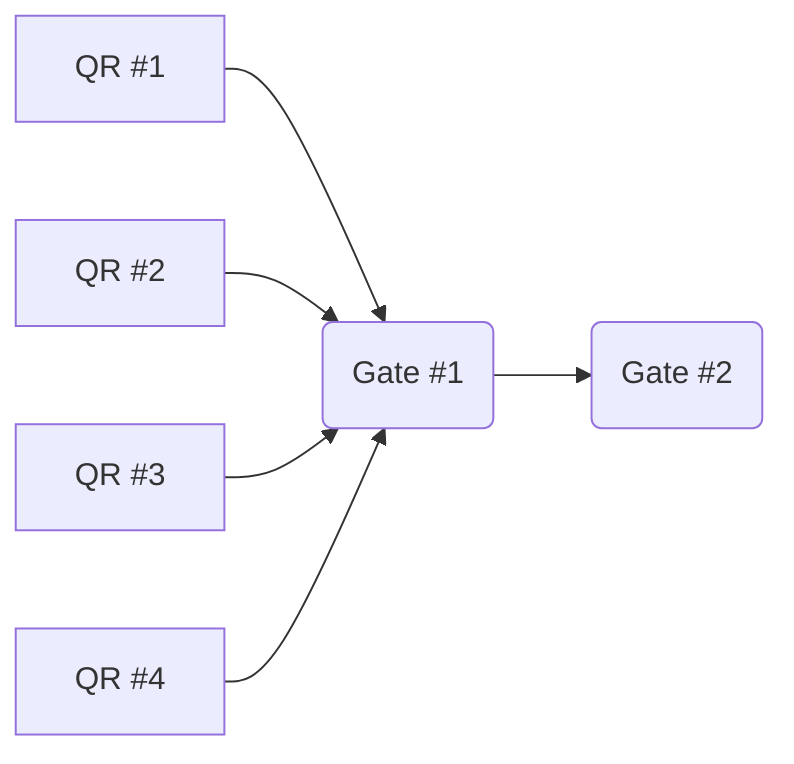

# Gates



## Data structure

### All gates 

`gates = [gate:gateId, ...]`

Use counter for creating `gateId` in special key e.g. `gates:current.gateId`, increment `incr gates:current.gateId` and used returned value as part of the keys `gate:gateId`.

    ```
    $ incr gates:current.gateId
    ```

    ``` 
    $ rpush gates "Gate:1"
    $ set Gate:1:name "To Buy"
    ```


- **Q:** How to change order or insert new gate in the between existing gates?
- **A:** Replacement possible with `LSET` on specific index. Alternatively rebuild complete list with `LSET`

### All items
`Items = [Item:itemId, ...]`

### List items in specific gate
`Gate:gateId:Items = [Item:itemId, ...]`

### Item properties
`Gate:gateId:Item:itemId = {name: value}`