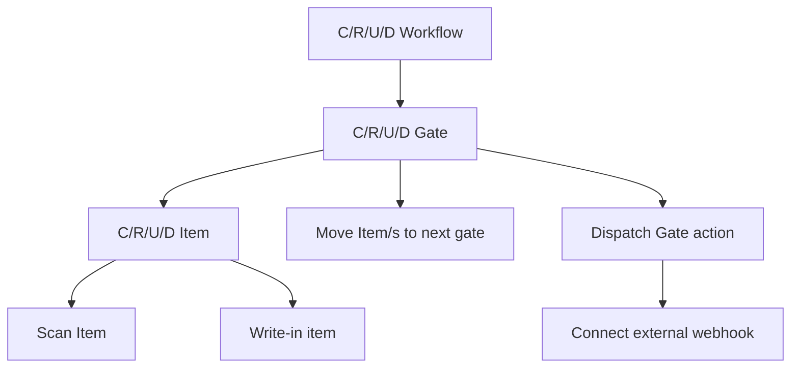

## Process graph

## Value Objects

### Workflow

#### Description
Workflow as a collection of **Gates**.

### Gate
#### Description
Gate as a collection of **Items**.

### Item
#### Description
Item as a collection of **Gates**.